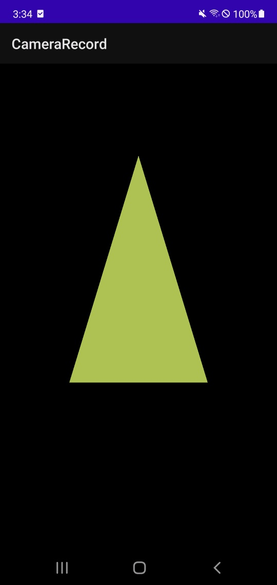

이전 글에서는 GLSurfaceView에 배경색상을 그려봤습니다.
이번에는 이전 포스팅의 소스코드를 기반으로 삼각형을 그려보겠습니다.

---

# 삼각형 정의

```
class Triangle {

    companion object {

        // 삼각형의 꼭지점 개수
        private const val COORDS_PER_VERTEX = 3
        
    }
    
    private val triangleCoords = floatArrayOf(  // 시계 반대방향
        0.0f, 0.622008459f, 0.0f,               // top
        -0.5f, -0.311004243f, 0.0f,             // bottom left
        0.5f, -0.311004243f, 0.0f               // bottom right
    )

    // 삼각형의 색상
    private val color = floatArrayOf(0.63671875f, 0.76953125f, 0.22265625f, 1.0f)

    /**
     * OpenGL ES를 사용하면 3차원 공간에서 좌표를 사용하여 그린 객체를 정의할수 있다.
     * 따라서 삼각형을 그리려면 먼저 좌표를 정의해야 합니다.
     * OpenGL에서는 일반적으로 부동 소수점 숫자로 된 꼭짓점 배열을 좌표로 정의합니다.
     *
     * 효율성을 극대화하려면
     * 이 좌표를 ByteBuffer에 쓴 다음 OpenGL ES 그래픽 파이프라인에 전달하여 처리하게 됩니다.
     * */
    private val vertexBuffer = ByteBuffer.allocateDirect(triangleCoords.size * 4).run {
        order(ByteOrder.nativeOrder())

        asFloatBuffer().apply {
            put(triangleCoords)
            position(0)
        }
    }
}
```

우리는 삼각형을 구현했으니, 도형을 그릴 준비를 해야됩니다.

---

# Triangle 전체 코드

```
class Triangle {

    companion object {

        // 삼각형의 꼭지점 개수
        private const val COORDS_PER_VERTEX = 3

        // 도형의 꼭짓점을 렌더링하는 OpenGL ES 코드
        private const val VERTEX_SHADER_CODE =
            "attribute vec4 vPosition;" +
                    "void main() {" +
                    "  gl_Position = vPosition;" +
                    "}"

        // 색상, 질감으로 도형의 면을 렌더링하는 OpenGL ES 코드
        private const val FRAGMENT_SHADER_CODE =
            "precision mediump float;" +
                    "uniform vec4 vColor;" +
                    "void main() {" +
                    "  gl_FragColor = vColor;" +
                    "}"
    }

    // 하나 이상의 도형을 그리는 데 사용할 셰이더가 포함된 OpenGL ES 객체
    private var mProgram: Int

    /**
     * draw()(도형을 그리기 전에) 함수를 호출하기위한 준비
     *
     * OpenGL ES로 도형을 그리려면 렌더링 파이프에 그릴 내용과 그리는 방법을 지시할
     * 여러 매개변수를 지정해야 합니다.
     * 그리기 옵션은 도형별로 다양하므로 도형 클래스에 그리기 로직을 포함 시키는것이 좋습니다.
     * */
    init {
        val vertexShader = loadShader(GLES20.GL_VERTEX_SHADER, VERTEX_SHADER_CODE)
        val fragmentShader = loadShader(GLES20.GL_FRAGMENT_SHADER, FRAGMENT_SHADER_CODE)

        mProgram = GLES20.glCreateProgram().also { program ->
            GLES20.glAttachShader(program, vertexShader)
            GLES20.glAttachShader(program, fragmentShader)
            GLES20.glLinkProgram(program)
        }
    }

    private val triangleCoords = floatArrayOf(  // 시계 반대방향
        0.0f, 0.622008459f, 0.0f,               // top
        -0.5f, -0.311004243f, 0.0f,             // bottom left
        0.5f, -0.311004243f, 0.0f               // bottom right
    )

    // 삼각형의 색상
    private val color = floatArrayOf(0.63671875f, 0.76953125f, 0.22265625f, 1.0f)

    /**
     * OpenGL ES를 사용하면 3차원 공간에서 좌표를 사용하여 그린 객체를 정의할수 있다.
     * 따라서 삼각형을 그리려면 먼저 좌표를 정의해야 합니다.
     * OpenGL에서는 일반적으로 부동 소수점 숫자로 된 꼭짓점 배열을 좌표로 정의합니다.
     *
     * 효율성을 극대화하려면
     * 이 좌표를 ByteBuffer에 쓴 다음 OpenGL ES 그래픽 파이프라인에 전달하여 처리하게 됩니다.
     * */
    private val vertexBuffer = ByteBuffer.allocateDirect(triangleCoords.size * 4).run {
        order(ByteOrder.nativeOrder())

        asFloatBuffer().apply {
            put(triangleCoords)
            position(0)
        }
    }

    private var mPositionHandle = 0
    private var mColorHandle = 0
    private val vertexCount = triangleCoords.size / COORDS_PER_VERTEX
    private val vertexStride = COORDS_PER_VERTEX * 4

    /**
     * 도형을 그리려면 셰이더 코드를 컴파일하고 OpenGL ES 프로그램 객체에 추가한 다음 프로그램을 링크해야 합니다.
     * 생성자에서 이 작업을 수행하므로 한 번만 수행됩니다.
     * */
    private fun loadShader(type: Int, shaderCode: String) = GLES20.glCreateShader(type).also { shader ->
        GLES20.glShaderSource(shader, shaderCode)
        GLES20.glCompileShader(shader)
    }

    /**
     * init 블록에서 도형을 그릴 프로그램을 생성하기 때문에
     * 우리는 onDrawFrame() 함수에서 draw() 함수만 호출하면 됩니다.
     *
     * 이 코드에서는 도형의 vertexShader와 fragmentShader의 위치, 색상 값을 설정한 다음 그리기 함수를 실행합니다.
     * */
    fun draw() {
        GLES20.glUseProgram(mProgram)
        mPositionHandle = GLES20.glGetAttribLocation(mProgram, "vPosition").also { index ->
            GLES20.glEnableVertexAttribArray(index)
            GLES20.glVertexAttribPointer(
                index,
                COORDS_PER_VERTEX,
                GLES20.GL_FLOAT,
                false,
                vertexStride,
                vertexBuffer
            )

            mColorHandle = GLES20.glGetUniformLocation(mProgram, "vColor").also { colorHandle ->
                GLES20.glUniform4fv(colorHandle, 1, color, 0)
            }

            GLES20.glDrawArrays(GLES20.GL_TRIANGLES, 0, vertexCount)
            GLES20.glDisableVertexAttribArray(index)
        }
    }
}
```

---

# MainActivity

```
class MainActivity : AppCompatActivity() {

    private lateinit var binding: ActivityMainBinding
    private lateinit var triangle: Triangle

    private val glSurfaceViewRenderer = object : GLSurfaceView.Renderer {
        override fun onSurfaceChanged(gl: GL10?, width: Int, height: Int) {}
        override fun onSurfaceCreated(gl: GL10?, config: EGLConfig?) {
            triangle = Triangle()
        }
        override fun onDrawFrame(gl: GL10?) {
            triangle.draw()
        }
    }

    override fun onCreate(savedInstanceState: Bundle?) {
        super.onCreate(savedInstanceState)
        setContentView(R.layout.activity_main)

        binding = DataBindingUtil.setContentView(this, R.layout.activity_main)
        with(binding.surfaceView) {
            setEGLContextClientVersion(3)
            setRenderer(glSurfaceViewRenderer)
            renderMode = GLSurfaceView.RENDERMODE_WHEN_DIRTY
        }
    }
}
```

---

# 결과



---

## 추가 설명이 필요하다면 공홈을 읽어보세요!
[공식 홈페이지](https://developer.android.com/training/graphics/opengl/draw?hl=ko)

---